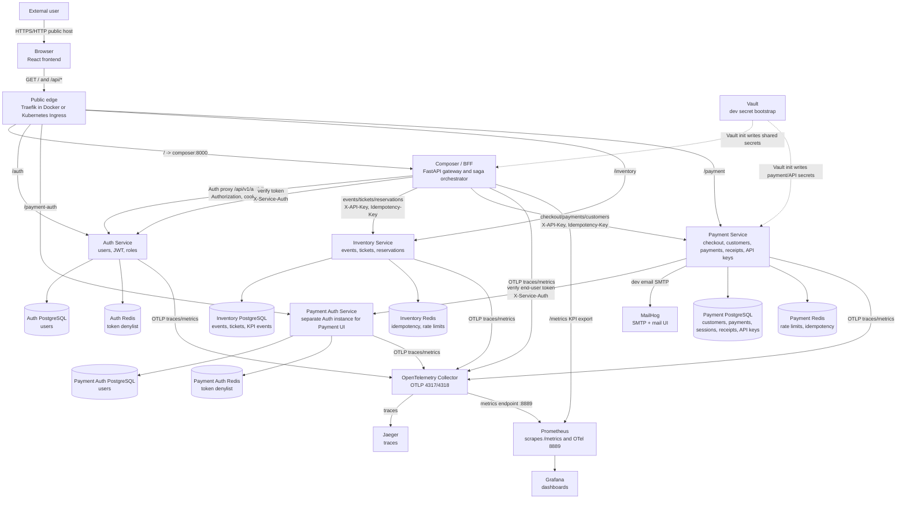
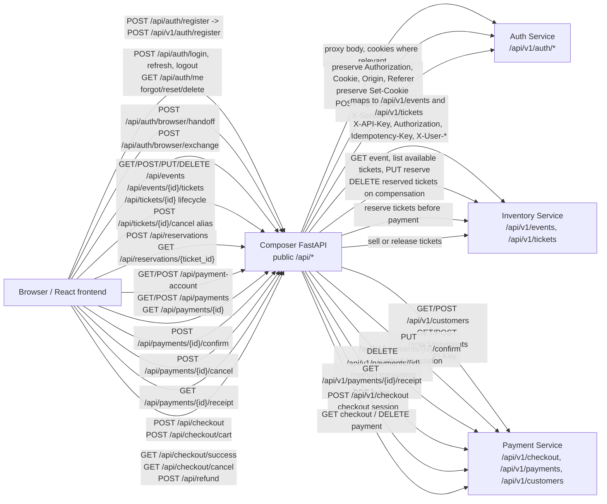
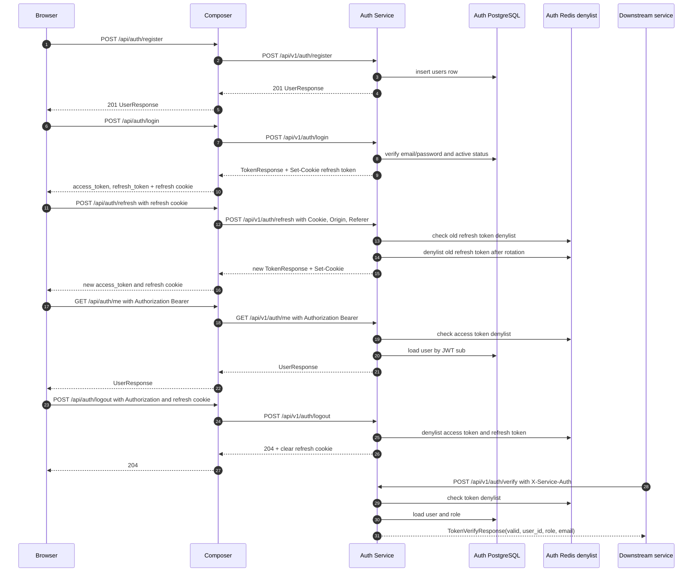
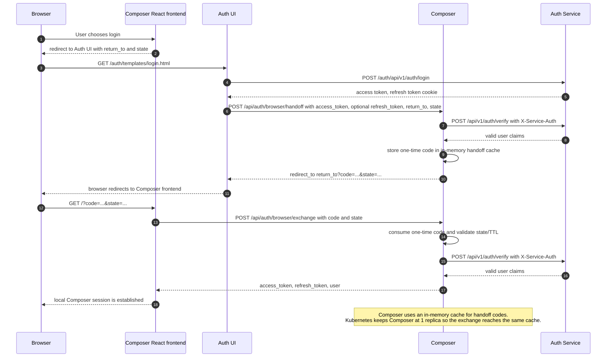
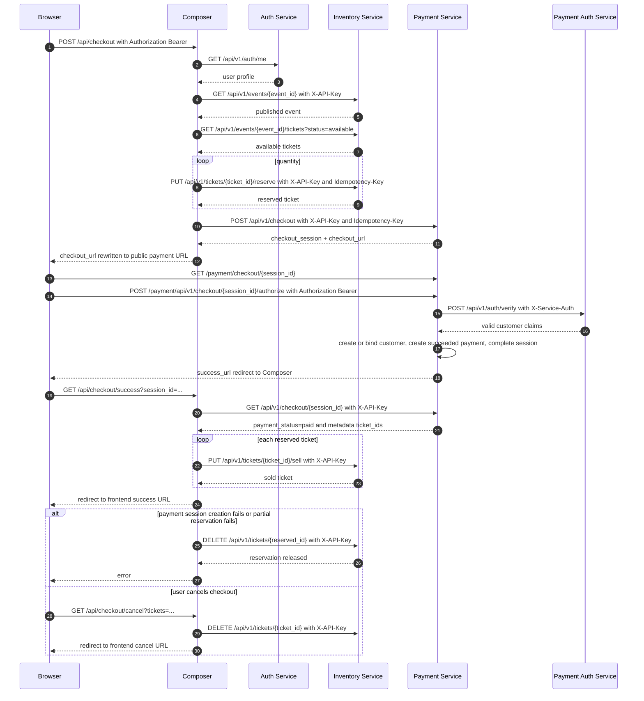
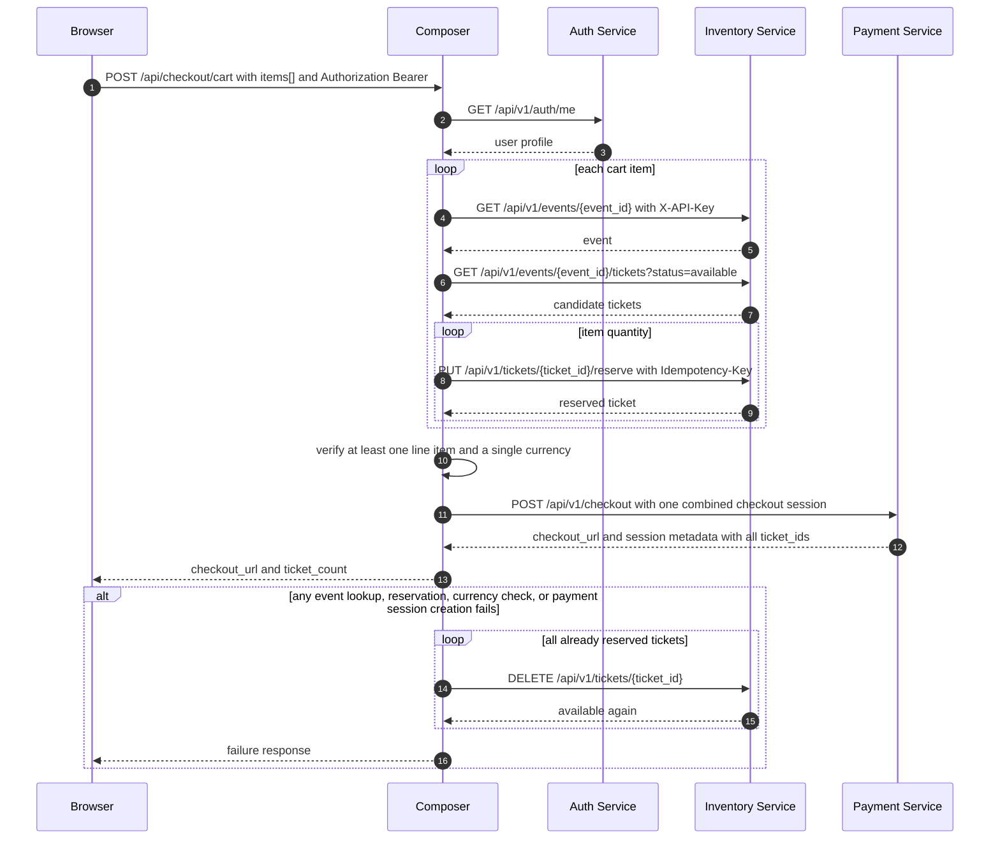
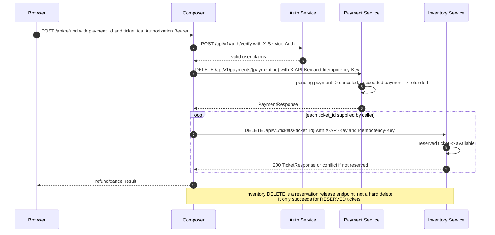
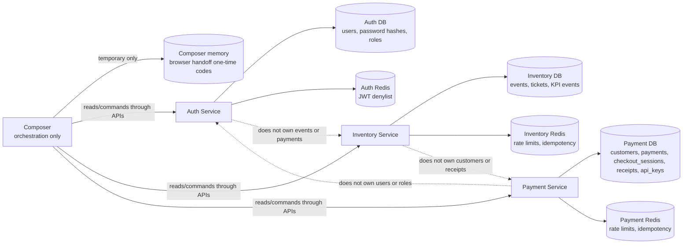
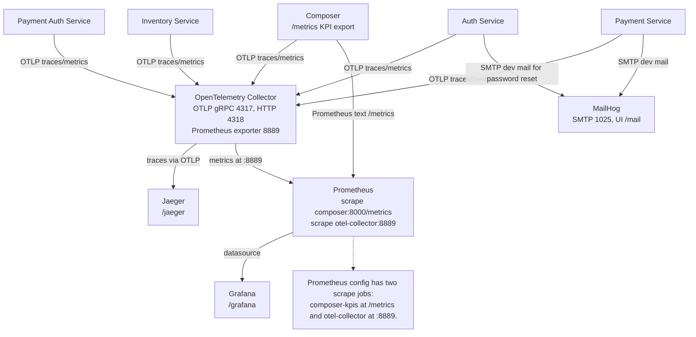

# FlashSale / EGS API Architecture

This document was built from the local source code and manifests in these repositories, not only from README files:

| Repository | Local path | Main responsibility checked |
|---|---:|---|
| composer-egs | `/home/andrealex/composer-egs` | React frontend, Composer/BFF, Docker Compose, Traefik, observability, Vault bootstrap, E2E script |
| EGS | `/home/andrealex/EGS` | Auth FastAPI service and Auth UI templates/static assets |
| Payment_service | `/home/andrealex/Payment_service` | Payment FastAPI service and static wallet/checkout UI |
| inventory-service-egs | `/home/andrealex/inventory-service-egs` | Inventory FastAPI service |
| EGS_k8s | `/home/andrealex/EGS_k8s` | Kubernetes namespace, deployments, stateful sets, services, ingress, secrets, observability |

The system is a microservice architecture with a browser-facing React app and a Composer/BFF gateway. Composer owns orchestration and API translation, while domain data remains inside the Auth, Inventory, and Payment services.

## Service Classification

| Class | Component | Verified implementation | Data ownership |
|---|---|---|---|
| Frontend / browser-facing | React frontend in `composer-egs/frontend` | Calls `/api/*` through Vite/browser and links to Auth/Payment UIs | Browser session/local state only |
| Composer / API Gateway / BFF | `composer-egs/main.py` | FastAPI gateway, frontend fallback, auth proxying, checkout saga, cart saga, refund saga, KPI aggregation | Temporary in-memory browser handoff code cache only |
| Auth Service | `EGS/auth-service/app` | FastAPI `/api/v1/auth/*`, `/internal/kpi/snapshot`, `/health` | Users, password hashes, roles, JWT validation, token denylist |
| Payment Auth Service | Docker/K8s second instance of Auth image | Same Auth code, separate Postgres/Redis/secrets/cookie name, used by Payment service | Separate Payment UI users/JWTs from main Composer Auth |
| Inventory Service | `inventory-service-egs/app` | FastAPI `/api/v1/events`, `/api/v1/tickets`, `/internal/kpi/*`, `/health` | Events, tickets, reservations, ticket KPI events |
| Payment Service | `Payment_service/app` | FastAPI `/api/v1/checkout`, `/api/v1/payments`, `/api/v1/customers`, `/api/v1/admin/api-keys`, static wallet/checkout pages | Customers, payments, checkout sessions, receipts, API keys |
| Databases | PostgreSQL per domain | Auth DB, Payment Auth DB, Inventory DB, Payment DB | One service writes each database |
| Redis | Redis per domain | Auth token denylist, Inventory idempotency/rate limit, Payment idempotency/rate limit | Cache/coordination only |
| Public edge | Traefik in Docker, Kubernetes Ingress in K8s | Host routing in Docker, path routing in K8s | No business data |
| Secrets | Vault dev server plus Kubernetes Secrets | Vault init writes internal/payment secrets; K8s secrets inject env vars | Secrets only |
| Observability | OTel Collector, Prometheus, Grafana, Jaeger, MailHog | OTLP traces/metrics, Prometheus scrape, dashboards, trace UI, dev mail | Telemetry/mail only |

## A. System Context Diagram

Source file: `docs/diagrams/system-context.mmd`



## B. Public API / Ingress Diagram

Source file: `docs/diagrams/public-ingress.mmd`

```mermaid
flowchart TB
  subgraph docker["Docker Compose public routing through Traefik host rules"]
    dHost["Hostnames on port 80"]
    dHost -->|"composer.flashsale"| dComposer["composer:8000"]
    dHost -->|"auth.flashsale"| dAuth["auth-service:8000"]
    dHost -->|"auth.flashsale/templates<br/>auth.flashsale/static"| dAuthFrontend["auth-frontend:80"]
    dHost -->|"payment-auth.flashsale"| dPaymentAuth["payment-auth-service:8000"]
    dHost -->|"inventory.flashsale"| dInventory["inventory-service:8000"]
    dHost -->|"payment.flashsale"| dPayment["payment-service:8000"]
    dHost -->|"traefik.flashsale"| dTraefik["Traefik dashboard"]
    dHost -->|"grafana.flashsale"| dGrafana["grafana:3000"]
    dHost -->|"vault.flashsale"| dVault["vault:8200"]
    dHost -->|"jaeger.flashsale"| dJaeger["jaeger:16686"]
  end

  subgraph k8s["Kubernetes public routing through Ingress"]
    kHost["grupo2-egs.deti.ua.pt"]
    kHost -->|"/"| kComposer["composer:8000"]
    kHost -->|"/auth/templates<br/>/auth/static"| kAuthFrontend["auth-frontend:80"]
    kHost -->|"/auth"| kAuth["auth-service:8000"]
    kHost -->|"/payment-auth"| kPaymentAuth["payment-auth-service:8000"]
    kHost -->|"/inventory"| kInventory["inventory-service:8000"]
    kHost -->|"/payment"| kPayment["payment-service:8000"]
    kHost -->|"/grafana"| kGrafana["grafana:3000"]
    kHost -->|"/prometheus"| kPrometheus["prometheus:9090"]
    kHost -->|"/jaeger"| kJaeger["jaeger:16686"]
    kHost -->|"/mail"| kMail["mailhog:8025"]
  end

  note1["Observed mismatch:<br/>Docker exposes vault.flashsale but no Prometheus/MailHog route.<br/>Kubernetes exposes /prometheus and /mail but no /vault path."]
  dHost -.-> note1
  kHost -.-> note1
```



### Public URL Mapping

| Environment | Public route | Backend service | Notes |
|---|---|---|---|
| Docker | `http://composer.flashsale/` | `composer:8000` | React SPA and `/api/*` via Composer |
| Docker | `http://auth.flashsale/` | `auth-service:8000` | Auth API; `/templates` and `/static` route to `auth-frontend:80` |
| Docker | `http://payment-auth.flashsale/` | `payment-auth-service:8000` | Separate Auth instance for Payment UI |
| Docker | `http://inventory.flashsale/` | `inventory-service:8000` | Inventory API |
| Docker | `http://payment.flashsale/` | `payment-service:8000` | Payment API and wallet/checkout static UI |
| Docker | `http://grafana.flashsale/` | `grafana:3000` | Observability UI |
| Docker | `http://jaeger.flashsale/` | `jaeger:16686` | Trace UI |
| Docker | `http://vault.flashsale/` | `vault:8200` | Vault dev UI/API |
| K8s | `http://grupo2-egs.deti.ua.pt/` | `composer:8000` | Composer has catch-all `/` path |
| K8s | `/auth/templates`, `/auth/static` | `auth-frontend:80` | Auth static UI assets |
| K8s | `/auth` | `auth-service:8000` | Auth API; service strips `/auth` prefix |
| K8s | `/payment-auth` | `payment-auth-service:8000` | Payment Auth API; service strips `/payment-auth` prefix |
| K8s | `/inventory` | `inventory-service:8000` | Inventory API; service strips `/inventory` prefix |
| K8s | `/payment` | `payment-service:8000` | Payment API/UI; service strips `/payment` prefix |
| K8s | `/grafana` | `grafana:3000` | Grafana configured with subpath root URL |
| K8s | `/prometheus` | `prometheus:9090` | Prometheus configured with `/prometheus` route prefix |
| K8s | `/jaeger` | `jaeger:16686` | Jaeger configured with `QUERY_BASE_PATH=/jaeger` |
| K8s | `/mail` | `mailhog:8025` | MailHog started with `-ui-web-path=mail` |

## C. Composer API Gateway Mapping Diagram

Source file: `docs/diagrams/composer-gateway-map.mmd`



## API Contracts And Security

| Mechanism | Implemented where | Verified behavior |
|---|---|---|
| JWT Bearer token | Composer public user endpoints, Auth `/me`/`logout`, Payment checkout authorization and customer self-transactions | `Authorization: Bearer <token>` is verified by Auth. Composer often verifies with Auth before calling downstream services. Payment verifies end-user checkout tokens through Payment Auth. |
| Refresh token cookie | Auth Service | Login and refresh set an HTTP-only refresh cookie. Cookie name defaults to `egs_refresh_token`; Payment Auth uses its own cookie name in Docker/K8s. Refresh with cookie enforces Origin/Referer against allowed origins. |
| `X-Service-Auth` | Auth `/api/v1/auth/verify` | Required for internal token verification. Composer and Payment call this endpoint with `INTERNAL_SERVICE_KEY`. |
| `X-Internal-Service-Key` | Auth `/internal/kpi/snapshot` | Required by Auth KPI endpoint. This differs from `X-Service-Auth`. |
| `X-API-Key` | Inventory and Payment APIs | Inventory requires it for all business and internal KPI endpoints. Payment requires it except explicitly skipped public/static checkout paths. Admin routes require the configured admin API key. |
| Admin API key vs tenant API key | Payment Service | `/api/v1/admin/api-keys/*` accepts only `ADMIN_API_KEY`. Tenant keys are stored hashed in Payment DB and can access normal Payment APIs according to middleware validation. |
| `Idempotency-Key` | Composer -> Inventory/Payment, Inventory middleware, Payment payment creation | Inventory caches POST/PUT/DELETE responses by API key, method, path and idempotency key. Payment uses Redis idempotency in payment creation; Composer generates keys for saga steps. |
| `X-Request-ID` / `X-Correlation-ID` | Composer, Auth, Payment, Inventory, OTel | Composer forwards incoming trace headers downstream. Auth and Payment add correlation/request response headers. Payment uses `X-Correlation-ID`. |
| CORS | Composer, Auth, Inventory, Payment | Composer uses `COMPOSER_CORS_ORIGINS`; Auth uses `BACKEND_CORS_ORIGINS`; Inventory and Payment currently allow broad origins. |
| Rate limiting | Auth, Inventory, Payment | Auth uses limiter configuration for auth endpoints. Inventory rate limits by API key/anonymous in Redis. Payment rate limits by API key in Redis. |
| Public vs internal | Edge routing plus service middleware | Composer `/api/*` is browser-facing. Auth verify/KPI, Inventory KPI, Payment normal business APIs are service-to-service in the intended deployment, even if reachable through direct public host/path when ingress exposes each service. |
| Ticket category compatibility | Composer -> Inventory | Inventory's canonical ticket field is `category`. Composer accepts frontend payloads with either `category` or legacy `ticket_category_id`, prefers `category` when both are present, and maps legacy `ticket_category_id` to `category` before ticket batch creation. |

## Endpoint Catalog

### Composer Public API

Composer lives at `/` in K8s and `composer.flashsale` in Docker. Internal service URLs are configured by `AUTH_SERVICE_URL`, `INVENTORY_SERVICE_URL`, and `PAYMENT_SERVICE_URL`. Composer forwards `X-Request-ID` and `X-Correlation-ID` when present.

| Method | Public path | Internal mapping | Auth and headers | Params/body/schema | Response/status | Data/downstream/error behavior |
|---|---|---|---|---|---|---|
| POST | `/api/auth/register` | Auth `POST /api/v1/auth/register` | Public; proxied JSON | Auth `UserCreate` | Auth `UserResponse`, 201 | Propagates Auth errors such as 400/409/422 |
| POST | `/api/auth/login` | Auth `POST /api/v1/auth/login` | Public; preserves `Set-Cookie` | Auth `UserLogin` | Auth `TokenResponse`, 200 | Auth DB password check, refresh cookie set |
| POST | `/api/auth/refresh` | Auth `POST /api/v1/auth/refresh` | Public with refresh cookie or body token; forwards `Cookie`, `Origin`, `Referer`; preserves `Set-Cookie` | Optional `TokenRefresh` | Auth `TokenResponse`, 200 | Auth Redis denylist and CSRF Origin/Referer check when cookie is used |
| GET | `/api/auth/me` | Auth `GET /api/v1/auth/me` | `Authorization: Bearer <token>` | None | Auth `UserResponse`, 200 | Auth Redis denylist and users table |
| POST | `/api/auth/logout` | Auth `POST /api/v1/auth/logout` | `Authorization: Bearer`; forwards cookie/origin/referer | None | 204 | Auth denylist; clears refresh cookie |
| POST | `/api/auth/forgot-password` | Auth `POST /api/v1/auth/forgot-password` | Public | `ForgotPasswordRequest` | `MessageResponse`, 200 | Auth may send/log reset email via MailHog/dev mail |
| POST | `/api/auth/reset-password` | Auth `POST /api/v1/auth/reset-password` | Public with reset token | `ResetPasswordRequest` | `MessageResponse`, 200 | Auth verifies password reset JWT |
| DELETE | `/api/auth/me` | Auth `DELETE /api/v1/auth/me` | `Authorization: Bearer` | `DeleteAccountRequest` with password | `MessageResponse`, 200 | Auth checks password, denylists token, deletes user |
| POST | `/api/auth/browser/handoff` | Composer-only plus Auth `POST /api/v1/auth/verify` | Public but validates `access_token`; Composer adds `X-Service-Auth` to Auth verify | `BrowserHandoffRequest` | `{redirect_to, expires_in_seconds}`, 200 | In-memory one-time code cache; errors 400/401/422 |
| POST | `/api/auth/browser/exchange` | Composer-only plus Auth verify | Public with one-time code/state | `BrowserHandoffExchangeRequest` | access token, optional refresh token, user, 200 | Consumes in-memory handoff code; errors 401/422 |
| GET | `/api/events` | Inventory `GET /api/v1/events`, then optional ticket enrichment | Optional Bearer; Composer adds `X-API-Key`; non-admin forced to `status=published` | Query params forwarded; Inventory `skip`, `limit`, `status` supported | Inventory event list enriched with min price/currency, 200 | Inventory DB; enrichment calls tickets endpoint |
| POST | `/api/events` | Inventory `POST /api/v1/events` | Admin/promoter required when `EVENT_MUTATIONS_REQUIRE_ADMIN=true`; `X-API-Key`, `Authorization`, `Idempotency-Key`, `X-User-*` | Inventory `EventCreate` | `EventResponse`, 201 | Inventory DB; 403 for non-admin/promoter |
| GET | `/api/events/{event_id}` | Inventory `GET /api/v1/events/{event_id}` plus paginated ticket fetch | Public through Composer; `X-API-Key` | Path `event_id` UUID | Event plus raw `tickets`, `tickets_total`, and grouped `ticket_categories`, 200 | Inventory DB; 404 propagated; category summaries are derived by Composer |
| PUT | `/api/events/{event_id}` | Inventory `PUT /api/v1/events/{event_id}` | Admin/promoter; `X-API-Key`, `Authorization`, idempotency | `EventUpdate` | `EventResponse`, 200 | Inventory DB; 403/404/422 |
| DELETE | `/api/events/{event_id}` | Inventory `DELETE /api/v1/events/{event_id}` | Admin/promoter; `X-API-Key`, idempotency | Path `event_id` UUID | 204 | Inventory cascades ticket rows; 403/404 |
| POST | `/api/events/{event_id}/tickets` | Inventory `POST /api/v1/events/{event_id}/tickets` | Admin/promoter; `X-API-Key`, idempotency | `TicketBatchCreate`; Composer accepts `category` or legacy `ticket_category_id` and sends `category` downstream | `TicketListResponse`, 201 | Inventory DB creates ticket batch |
| GET | `/api/events/{event_id}/tickets` | Inventory `GET /api/v1/events/{event_id}/tickets` | Public through Composer; `X-API-Key` | Query `skip`, `limit`, `status` | `TicketListResponse`, 200 | Inventory DB |
| GET | `/api/tickets/{ticket_id}` | Inventory `GET /api/v1/tickets/{ticket_id}` | Public through Composer; `X-API-Key` | Path `ticket_id` UUID | `TicketResponse`, 200 | Inventory DB |
| GET | `/api/tickets/{ticket_id}/availability` | Inventory `GET /api/v1/tickets/{ticket_id}` | Public through Composer; `X-API-Key` | Path `ticket_id` UUID | `TicketResponse`, 200 | Same as ticket detail |
| PUT | `/api/tickets/{ticket_id}/reserve` | Inventory `PUT /api/v1/tickets/{ticket_id}/reserve` | Admin/promoter via Composer; `X-API-Key`, idempotency | Path `ticket_id` UUID | `TicketResponse`, 200 | Inventory atomic row lock; 409 if not available/published |
| PUT | `/api/tickets/{ticket_id}/sell` | Inventory `PUT /api/v1/tickets/{ticket_id}/sell` | Admin/promoter via Composer; `X-API-Key`, idempotency | Path `ticket_id` UUID | `TicketResponse`, 200 | Inventory reserved -> sold; 409 otherwise |
| PUT | `/api/tickets/{ticket_id}/use` | Inventory `PUT /api/v1/tickets/{ticket_id}/use` | Admin/promoter via Composer; `X-API-Key`, idempotency | Path `ticket_id` UUID | `TicketResponse`, 200 | Inventory sold -> used; 409 otherwise |
| DELETE | `/api/tickets/{ticket_id}` | Inventory `DELETE /api/v1/tickets/{ticket_id}` | Admin/promoter via Composer; `X-API-Key`, idempotency | Path `ticket_id` UUID | `TicketResponse`, 200 | Inventory releases reserved ticket, not hard delete |
| POST | `/api/tickets/{ticket_id}/cancel` | Inventory `DELETE /api/v1/tickets/{ticket_id}` | Admin/promoter via Composer; `X-API-Key`, idempotency | Path `ticket_id` UUID | `TicketResponse`, 200 | Backward-compatible frontend alias for the same reservation release |
| POST | `/api/reservations` | Inventory event lookup, tickets list, repeated `PUT /tickets/{id}/reserve` | Public in code; Composer adds `X-API-Key` | `ReservationRequest`: `event_id`, `quantity`, optional `category` or legacy `ticket_category_id` | `{tickets: [...]}`, 200 | Reserves tickets; filters against Inventory `category`; compensates with DELETE on partial failure |
| GET | `/api/reservations/{ticket_id}` | Inventory `GET /api/v1/tickets/{ticket_id}` | Public through Composer; `X-API-Key` | Path `ticket_id` UUID | `TicketResponse`, 200 | Reservation state is represented by ticket status |
| GET | `/api/payment-account` | Payment `GET /api/v1/customers?email=...` | `Authorization: Bearer`; Composer verifies Auth profile; Payment `X-API-Key` | None | `{exists, customer, identity_email}`, 200 | Auth users table, Payment customers table |
| POST | `/api/payment-account/setup` | Payment `GET /api/v1/customers`, then `POST /api/v1/customers` if absent | `Authorization: Bearer`; Payment `X-API-Key`, idempotency | No required body | setup result, 200/201-like JSON | Idempotent customer provisioning by email |
| GET | `/api/payments` | Payment `GET /api/v1/payments`, filtered by customer/metadata | `Authorization: Bearer`; Payment `X-API-Key` | Query from frontend plus limit/offset | Filtered `PaymentListResponse`, 200 | Auth profile, Payment customer lookup, Payment DB |
| POST | `/api/payments` | Payment `POST /api/v1/payments` | No Bearer required in Composer code; Payment `X-API-Key`, idempotency | Payment `PaymentCreate` | `PaymentResponse`, 201 | Payment DB/Redis; access concern documented below |
| GET | `/api/payments/{payment_id}` | Payment `GET /api/v1/payments/{payment_id}` | `Authorization: Bearer`; Payment `X-API-Key` | Path `payment_id` UUID | `PaymentResponse`, 200 | Composer enforces customer ownership by Payment customer id |
| POST | `/api/payments/{payment_id}/confirm` | Payment `PUT /api/v1/payments/{payment_id}/confirm` | No Bearer required in Composer code; Payment `X-API-Key` | Path `payment_id` UUID | `PaymentResponse`, 200 | Method translation POST -> PUT |
| POST | `/api/payments/{payment_id}/cancel` | Payment `DELETE /api/v1/payments/{payment_id}` | No Bearer required in Composer code; Payment `X-API-Key` | Path `payment_id` UUID | `PaymentResponse`, 200 | Method translation POST -> DELETE; cancel/refund logic in Payment |
| GET | `/api/payments/{payment_id}/receipt` | Payment `GET /api/v1/payments/{payment_id}/receipt` | `Authorization: Bearer`; Payment `X-API-Key` | Path `payment_id` UUID | PDF bytes, 200 | Composer checks customer id or metadata initiator id |
| POST | `/api/checkout` | Auth me, Inventory reserve, Payment `POST /api/v1/checkout` | `Authorization: Bearer`; downstream `X-API-Key`, idempotency | `CheckoutRequest` with optional `category` or legacy `ticket_category_id` | Checkout session plus public checkout URL, 200 | Saga: reserve ticket(s), filter against Inventory `category`, create payment checkout, compensate reservations on failure |
| POST | `/api/checkout/cart` | Auth me, Inventory multi-reserve, Payment `POST /api/v1/checkout` | `Authorization: Bearer`; downstream `X-API-Key`, idempotency | `CartCheckoutRequest` items with optional `category` or legacy `ticket_category_id` | Combined checkout session, 200 | Multi-reservation saga; rejects mixed currencies; compensates all reservations on failure |
| GET | `/api/checkout/success` | Payment `GET /api/v1/checkout/{session_id}`, Inventory `PUT /tickets/{id}/sell` | Public callback; downstream `X-API-Key` | Query `session_id` | Redirect to frontend success URL | Sells reserved tickets after paid session; partial failure compensation is limited by Inventory rules |
| GET | `/api/checkout/cancel` | Inventory `DELETE /api/v1/tickets/{id}` | Public callback; downstream `X-API-Key` | Query `tickets`, optional `frontend_url` | Redirect to cancel URL | Releases reserved tickets |
| POST | `/api/refund` | Auth verify, Payment `DELETE /api/v1/payments/{id}`, Inventory `DELETE /tickets/{id}` | `Authorization: Bearer`; Auth `X-Service-Auth`; Payment/Inventory `X-API-Key` | `RefundRequest`: `payment_id`, `ticket_ids`, `reason` | Refund/cancel result JSON | Payment cancels/refunds; Inventory only releases reserved tickets |
| GET | `/api/kpi/dashboard` | Auth KPI, Inventory KPI, Payment KPI, health checks | Admin/promoter Bearer; Auth `X-Internal-Service-Key`; Inventory/Payment `X-API-Key` | None | Aggregated KPI JSON, 200 | Read-only aggregation; includes fallback Payment calculations |
| GET | `/metrics` | Composer internal KPI collection | Public | None | Prometheus text, 200 | Scraped by Prometheus as `composer-kpis` |
| GET | `/health` | Auth `/health`, Inventory `/health`, Payment `/health` | Public | None | 200 if all online, else 503 | Service health aggregation |
| GET | non-API SPA paths | Composer frontend fallback | Public | Path | React `index.html` or redirect | Redirects `/templates/*` to Auth UI and `/wallet/*`/`/checkout/*` to Payment UI |

### Auth Internal API

Router prefix verified in code: `APIRouter(prefix="/auth")`, included under `/api/v1`, so effective API prefix is `/api/v1/auth`. In K8s/Docker public path can additionally be `/auth/api/v1/auth/*` because the service strips the ingress prefix.

| Method | Internal path | Auth/headers | Params/body/schema | Response/status | Data/downstream/error behavior |
|---|---|---|---|---|---|
| GET | `/` | Public | None | service info, 200 | No DB |
| GET | `/health` | Public | None | health JSON, 200 | No deep DB check in observed code |
| POST | `/api/v1/auth/register` | Public | `UserCreate`: email, password, full_name, role default fan | `UserResponse`, 201 | Writes `users`; duplicate 409; promoter role constrained to `@prom.pt`; bad request 400 |
| POST | `/api/v1/auth/login` | Public; rate limited | `UserLogin`: email, password | `TokenResponse`, 200, plus refresh cookie | Reads users, verifies password; inactive 403; invalid 401 |
| POST | `/api/v1/auth/refresh` | Public with refresh cookie or body token; Origin/Referer checked for cookie refresh | Optional `TokenRefresh` | `TokenResponse`, 200, rotated refresh cookie | Redis denylist check/write; 401 invalid; 503 Redis unavailable |
| GET | `/api/v1/auth/me` | `Authorization: Bearer` | None | `UserResponse`, 200 | Redis denylist and users table; 401/404 |
| POST | `/api/v1/auth/logout` | `Authorization: Bearer`; cookie optional | None | 204, clear cookie | Denylists access and refresh tokens in Redis; 401 |
| POST | `/api/v1/auth/verify` | `X-Service-Auth: <INTERNAL_SERVICE_KEY>` | `TokenVerifyRequest`: token | `TokenVerifyResponse`, 200 | 403 for bad service key; invalid tokens return `{valid:false}` |
| POST | `/api/v1/auth/forgot-password` | Public; rate limited | `ForgotPasswordRequest`: email | `MessageResponse`, 200 | Creates password reset token if active user exists; intentionally avoids account enumeration |
| POST | `/api/v1/auth/reset-password` | Public | `ResetPasswordRequest`: token, new_password | `MessageResponse`, 200 | Verifies password reset JWT; 401/404 |
| DELETE | `/api/v1/auth/me` | `Authorization: Bearer` | `DeleteAccountRequest`: password | `MessageResponse`, 200 | Password check, token denylist, user delete; 401/404 |
| GET | `/internal/kpi/snapshot` | `X-Internal-Service-Key: <INTERNAL_SERVICE_KEY>` | None | user KPI snapshot, 200 | Counts total/active/inactive/users by role from `users` |

Auth data model verified in code:

| Model/table | Fields |
|---|---|
| `users` | `id`, `email`, `full_name`, `hashed_password`, `is_active`, `role` enum `fan/promoter/admin`, `created_at`, `updated_at` |
| JWT access payload | `sub`, `email`, `role`, token type and expiry from Auth token utility |
| JWT refresh payload | `sub`, token type `refresh`, expiry |
| Redis denylist | JWT IDs/tokens with TTL for access, refresh and deleted-account flows |

### Inventory Internal API

Routers verified: `/api/v1/events`, `/api/v1/tickets`, `/internal/kpi`, `/health`. Every business/KPI route requires `X-API-Key`; `/health`, docs and OpenAPI are excluded by middleware. `Idempotency-Key` is supported on POST/PUT/DELETE and stored in Redis for 24 hours. Rate limiting also uses Redis.

| Method | Internal path | Auth/headers | Params/body/schema | Response/status | Data/downstream/error behavior |
|---|---|---|---|---|---|
| GET | `/health` | Public | None | 200 healthy or 503 unhealthy | Checks PostgreSQL and Redis |
| POST | `/api/v1/events` | `X-API-Key`; optional `Idempotency-Key` | `EventCreate`: name, description, venue, date, end_date, max_capacity, image_url | `EventResponse`, 201 | Creates event with draft status |
| GET | `/api/v1/events` | `X-API-Key` | Query `skip`, `limit`, optional `status` | `EventListResponse`, 200 | Reads events table |
| GET | `/api/v1/events/{event_id}` | `X-API-Key` | UUID path | `EventResponse`, 200 | 404 if not found |
| PUT | `/api/v1/events/{event_id}` | `X-API-Key`; optional `Idempotency-Key` | `EventUpdate`: optional fields plus status | `EventResponse`, 200 | Updates events table; 404/422 |
| DELETE | `/api/v1/events/{event_id}` | `X-API-Key`; optional `Idempotency-Key` | UUID path | 204 | Deletes event and cascades tickets |
| POST | `/api/v1/events/{event_id}/tickets` | `X-API-Key`; optional `Idempotency-Key` | `TicketBatchCreate`: category, price, currency, quantity | `TicketListResponse`, 201 | Creates ticket rows; records KPI event |
| GET | `/api/v1/events/{event_id}/tickets` | `X-API-Key` | Query `skip`, `limit`, optional `status` | `TicketListResponse`, 200 | Reads tickets for event; 404 if event missing |
| GET | `/api/v1/tickets/{ticket_id}` | `X-API-Key` | UUID path | `TicketResponse`, 200 | 404 if not found |
| PUT | `/api/v1/tickets/{ticket_id}/reserve` | `X-API-Key`; optional `Idempotency-Key` | UUID path | `TicketResponse`, 200 | Atomic row lock; only published event and available ticket; 409 on invalid state |
| PUT | `/api/v1/tickets/{ticket_id}/sell` | `X-API-Key`; optional `Idempotency-Key` | UUID path | `TicketResponse`, 200 | Reserved -> sold; 409 if not reserved |
| PUT | `/api/v1/tickets/{ticket_id}/use` | `X-API-Key`; optional `Idempotency-Key` | UUID path | `TicketResponse`, 200 | Sold -> used; 409 if not sold |
| DELETE | `/api/v1/tickets/{ticket_id}` | `X-API-Key`; optional `Idempotency-Key` | UUID path | `TicketResponse`, 200 | Reserved -> available; 409 if ticket is not reserved |
| GET | `/internal/kpi/snapshot` | `X-API-Key` | Query optional `event_id` | `KPISnapshotResponse`, 200 | Aggregates event/ticket counts and revenue from Inventory DB |
| GET | `/internal/kpi/events` | `X-API-Key` | Query `cursor`, optional `event_id`, `limit` | KPI event feed, 200 | Reads immutable `kpi_events` table |

Inventory state machines verified in code:

| Domain | States / transitions |
|---|---|
| Event lifecycle | `draft`, `published`, `cancelled`, `sold_out`, `completed`; reserve requires event status `published` |
| Ticket lifecycle | `available -> reserved -> sold -> used`; `reserved -> available` through DELETE release or TTL expiry |
| Reservation TTL | Background task expires reservations older than `ticket_reservation_ttl_minutes`, default/configured 15 minutes |
| Atomicity | Ticket reserve uses database row locking (`SELECT ... FOR UPDATE`) and status checks; idempotency middleware prevents duplicate POST/PUT/DELETE side effects when key is reused |

### Payment Internal API

Router prefix verified: `/api/v1`. Middleware strips `/payment` when exposed through K8s. Most API routes require `X-API-Key`; static UI, health, OpenAPI/docs, `GET /api/v1/checkout/{session_id}`, `POST /api/v1/checkout/{session_id}/authorize`, and `/api/v1/customers/me` are exempt from API-key middleware. User-facing authorization endpoints still require a Bearer token.

| Method | Internal path | Auth/headers | Params/body/schema | Response/status | Data/downstream/error behavior |
|---|---|---|---|---|---|
| GET | `/health` | Public | None | health JSON, 200 | No auth |
| GET | `/internal/kpi/snapshot` | `X-API-Key` through middleware | None | Payment KPI JSON, 200 | Aggregates Payment DB |
| POST | `/api/v1/checkout` | `X-API-Key`; optional `Idempotency-Key` from Composer | `CheckoutSessionCreate`: line_items, currency, success_url, cancel_url, customer_email/name, metadata | `CheckoutSessionResponse`, 201 | Creates checkout session, optional existing customer binding |
| GET | `/api/v1/checkout/{session_id}` | Public by middleware exception | UUID path | `CheckoutSessionResponse`, 200 | Reads checkout session; may mark open session complete if payment succeeded |
| POST | `/api/v1/checkout/{session_id}/authorize` | `Authorization: Bearer <token>`; no API key required | UUID path | `CheckoutAuthorizeResponse`, 200 | Calls Auth/Payment Auth `/api/v1/auth/verify` with `X-Service-Auth`; creates/binds customer and succeeded payment |
| POST | `/api/v1/payments` | `X-API-Key`; optional `Idempotency-Key` | `PaymentCreate`: amount, currency, customer_id, description, metadata | `PaymentResponse`, 201 | Creates pending payment; verifies customer; Redis idempotency |
| GET | `/api/v1/payments` | `X-API-Key` | Query `limit`, `offset`, optional `status`, optional `customer_id` | `PaymentListResponse`, 200 | Reads payments table |
| GET | `/api/v1/payments/{payment_id}` | `X-API-Key` | UUID path | `PaymentResponse`, 200 | 404 if not found |
| PUT | `/api/v1/payments/{payment_id}/confirm` | `X-API-Key` | UUID path | `PaymentResponse`, 200 | Pending/requires_action -> succeeded; already succeeded is idempotent |
| DELETE | `/api/v1/payments/{payment_id}` | `X-API-Key` | UUID path | `PaymentResponse`, 200 | Pending/processing/requires_action -> canceled; succeeded/partially_refunded -> refunded |
| GET | `/api/v1/payments/{payment_id}/receipt` | `X-API-Key` | UUID path | PDF `application/pdf`, 200 | Only for succeeded payments; creates/stores receipt if needed |
| POST | `/api/v1/customers` | `X-API-Key` | `CustomerCreate`: email, name, phone, metadata | `CustomerResponse`, 201 | Creates customer |
| GET | `/api/v1/customers` | `X-API-Key` | Query `limit`, `offset`, optional `email` | `CustomerListResponse`, 200 | Email filter used by Composer |
| GET | `/api/v1/customers/me/transactions` | `Authorization: Bearer <token>`; no API key required | Query `limit`, `offset` | `PaymentListResponse`, 200 | Verifies token through Auth, auto-provisions customer if absent |
| GET | `/api/v1/customers/{customer_id}` | `X-API-Key` | UUID path | `CustomerResponse`, 200 | 404 if not found |
| PUT | `/api/v1/customers/{customer_id}` | `X-API-Key` | `CustomerUpdate` | `CustomerResponse`, 200 | Updates customer |
| DELETE | `/api/v1/customers/{customer_id}` | `X-API-Key` | UUID path | 204 | Soft-deletes/deactivates customer |
| POST | `/api/v1/admin/api-keys` | Admin `X-API-Key` only | `ApiKeyCreate` | `ApiKeyCreatedResponse`, 201 | Stores hashed tenant key; raw key returned once |
| GET | `/api/v1/admin/api-keys` | Admin `X-API-Key` only | Query `limit`, `offset`, optional `is_active` | API key list, 200 | Reads API key metadata |
| GET | `/api/v1/admin/api-keys/{key_id}` | Admin `X-API-Key` only | UUID path | API key response, 200 | 404 if missing |
| PUT | `/api/v1/admin/api-keys/{key_id}` | Admin `X-API-Key` only | `ApiKeyUpdate` | API key response, 200 | Updates scopes/rate limits/status |
| DELETE | `/api/v1/admin/api-keys/{key_id}` | Admin `X-API-Key` only | UUID path | 204 | Revokes/deletes API key |

Payment data model verified in code:

| Model/table | Important fields |
|---|---|
| `customers` | `id`, `email`, `name`, `phone`, `metadata`, `is_active`, timestamps |
| `payments` | `id`, `customer_id`, `amount`, `currency`, `status`, `description`, `metadata`, `idempotency_key`, `amount_refunded`, timestamps |
| `checkout_sessions` | `id`, `status`, `line_items`, `amount_total`, `currency`, `success_url`, `cancel_url`, `customer_id`, `metadata`, `payment_id`, `expires_at` |
| `receipts` | `id`, `payment_id`, `receipt_number`, `pdf_data`, `created_at` |
| `api_keys` | hashed key, key prefix, client name, scopes, active flag, rate limit settings, expiry, last used |
| `refunds` | Model exists in the codebase, but current refund/cancel endpoint updates payment status/amount rather than creating a separate refund row |

### Kubernetes Public Paths

| Public path | Service | Internal DNS and port | Replica count | Notes |
|---|---|---|---:|---|
| `/` | Composer | `composer:8000` | 1 | One replica because browser handoff codes are stored in process memory |
| `/auth` | Auth | `auth-service:8000` | 2 | Prefix stripped by Auth middleware |
| `/auth/templates`, `/auth/static` | Auth frontend | `auth-frontend:80` | 2 | Static Auth UI from `EGS/frontend` |
| `/payment-auth` | Payment Auth | `payment-auth-service:8000` | 2 | Same Auth image, separate DB/Redis/JWT/cookie configuration |
| `/inventory` | Inventory | `inventory-service:8000` | 2 | Prefix stripped by Inventory middleware |
| `/payment` | Payment | `payment-service:8000` | 2 | Prefix stripped by Payment middleware |
| `/grafana` | Grafana | `grafana:3000` | 1 StatefulSet | Configured with subpath root URL |
| `/prometheus` | Prometheus | `prometheus:9090` | 1 StatefulSet | Configured with route prefix `/prometheus` |
| `/jaeger` | Jaeger | `jaeger:16686` | 1 | Configured with `QUERY_BASE_PATH=/jaeger` |
| `/mail` | MailHog | `mailhog:8025` | 1 | UI web path `mail` |

Kubernetes namespace is `tenant-grupo2-egs-deti-ua-pt`. Databases and Redis are StatefulSets with Longhorn PVCs: Auth Postgres/Redis, Payment Auth Postgres/Redis, Inventory Postgres/Redis, Payment Postgres/Redis, Prometheus, Grafana, and Vault. A Vault init Job writes internal/payment secrets into the dev Vault.

### Static UI Routes And Framework Routes

| Route | Owner | Public form | Type |
|---|---|---|---|
| `/` and SPA fallback | Composer | `/` | React frontend, not OpenAPI |
| `/templates/*` | Auth frontend | `/auth/templates/*` in K8s/Docker Auth host | Static HTML templates |
| `/static/*` | Auth frontend and Payment | `/auth/static/*`, `/payment/static/*` | Static CSS/JS/assets |
| `/wallet/login` | Payment | `/payment/wallet/login` in K8s | Static wallet page |
| `/wallet/register` | Payment | `/payment/wallet/register` in K8s | Static wallet page |
| `/wallet/dashboard` | Payment | `/payment/wallet/dashboard` in K8s | Static wallet page |
| `/checkout/{session_id}` | Payment | `/payment/checkout/{session_id}` in K8s | Static checkout page |
| `/docs`, `/redoc`, `/openapi.json` | FastAPI services | Under each service public base if exposed | Framework-generated documentation |

### Health, Metrics, And Observability Endpoints

| Endpoint/path | Owner | Auth | Notes |
|---|---|---|---|
| `GET /health` | Composer | Public | Aggregates Auth, Inventory, Payment health |
| `GET /metrics` | Composer | Public | Prometheus text with KPI-derived metrics |
| `GET /health` | Auth | Public | Basic Auth service health |
| `GET /internal/kpi/snapshot` | Auth | `X-Internal-Service-Key` | Used by Composer KPI dashboard/metrics |
| `GET /health` | Inventory | Public | PostgreSQL and Redis checks |
| `GET /internal/kpi/snapshot` | Inventory | `X-API-Key` | Inventory KPI snapshot |
| `GET /internal/kpi/events` | Inventory | `X-API-Key` | Inventory KPI event feed |
| `GET /health` | Payment | Public | Payment service health |
| `GET /internal/kpi/snapshot` | Payment | `X-API-Key` | Payment KPI snapshot |
| `/grafana` | Grafana | Grafana login | K8s public observability UI |
| `/prometheus` | Prometheus | Public in manifest | K8s public metrics UI |
| `/jaeger` | Jaeger | Public in manifest | K8s public trace UI |
| `/mail` | MailHog | Public in manifest | K8s public dev mail UI |
| OTel `4317/4318` | OTel Collector | Internal | Services export OTLP traces/metrics |
| OTel `8889` | OTel Collector | Internal scrape | Prometheus scrapes collector metrics exporter |

## D. Auth Flow Sequence Diagram

Source file: `docs/diagrams/auth-flow.mmd`



## E. Browser Auth Handoff Sequence Diagram

Source file: `docs/diagrams/browser-handoff-flow.mmd`



## F. Checkout Saga Sequence Diagram

Source file: `docs/diagrams/checkout-saga.mmd`



## G. Cart Checkout Sequence Diagram

Source file: `docs/diagrams/cart-checkout-saga.mmd`



## H. Refund / Cancel Sequence Diagram

Source file: `docs/diagrams/refund-flow.mmd`



Exact cancel/refund method mapping:

| User-facing Composer route | Payment route called | Inventory route called | Meaning |
|---|---|---|---|
| `POST /api/payments/{id}/cancel` | `DELETE /api/v1/payments/{id}` | None | Composer changes browser-friendly POST into Payment DELETE |
| `POST /api/refund` | `DELETE /api/v1/payments/{payment_id}` | `DELETE /api/v1/tickets/{ticket_id}` for each supplied ticket | Payment cancels/refunds; Inventory releases reservations only if still reserved |
| `GET /api/checkout/cancel?tickets=...` | None | `DELETE /api/v1/tickets/{ticket_id}` | Release reserved tickets after checkout cancellation |

## I. Data Ownership Diagram

Source file: `docs/diagrams/data-ownership.mmd`



Each database belongs to exactly one service. Composer never writes directly to domain databases; it calls domain APIs. This is important for consistency: Auth is the only source of truth for users and roles, Inventory is the only source of truth for ticket state, and Payment is the only source of truth for payments, checkout sessions, receipts, customers and API keys.

## J. Observability Diagram

Source file: `docs/diagrams/observability.mmd`



Prometheus configuration in both Docker and K8s has exactly two scrape jobs:

| Job | Target | Metrics path |
|---|---|---|
| `composer-kpis` | `composer:8000` | `/metrics` |
| `otel-collector` | `otel-collector:8889` | default Prometheus path |

## Main Business Flows

| Flow | Steps | Compensation/error behavior |
|---|---|---|
| Register/login | Browser calls Composer Auth endpoints; Composer proxies Auth and preserves cookies; Auth writes/reads users and Redis denylist | Auth returns exact errors for duplicate email, invalid password, inactive user, bad reset token |
| Browser handoff | Auth UI logs in separately, calls Composer handoff with token; Composer verifies token and creates one-time in-memory code; frontend exchanges code | Code expires by TTL and is single-use. Composer has 1 replica in K8s because cache is local memory |
| Single checkout | Composer verifies user, checks event published, reserves selected ticket(s), creates Payment checkout session, rewrites checkout URL to public Payment URL | If reservation or payment session creation fails, Composer releases already reserved tickets |
| Payment authorization | Browser opens Payment checkout UI and posts Bearer token to Payment authorize endpoint; Payment verifies token with Payment Auth and creates succeeded payment | Missing/invalid token returns 401; Auth service unavailable returns 503 |
| Checkout success | Composer reads Payment checkout session, extracts ticket IDs from metadata, sells each reserved ticket in Inventory | Already sold/confirmed/used tickets are tolerated in Composer; other failures trigger limited compensation |
| Cart checkout | Composer loops over items, validates each event, reserves all tickets, rejects mixed currencies, creates one combined Payment session | Any partial failure releases all already reserved tickets |
| Cancel/refund | Composer maps public cancel/refund requests to Payment DELETE and Inventory DELETE release calls | Payment can cancel pending or refund succeeded payments; Inventory DELETE only releases reserved tickets |

## Kubernetes Deployment Notes

| Area | Verified detail |
|---|---|
| Namespace | `tenant-grupo2-egs-deti-ua-pt` |
| Public host | `grupo2-egs.deti.ua.pt` |
| Internal service DNS | `auth-service:8000`, `payment-auth-service:8000`, `inventory-service:8000`, `payment-service:8000`, `composer:8000` |
| Composer replicas | 1, because `/api/auth/browser/handoff` stores one-time codes in process memory |
| Two-replica services | Auth, Auth frontend, Payment Auth, Inventory, Payment |
| Stateful services | Auth Postgres/Redis, Payment Auth Postgres/Redis, Inventory Postgres/Redis, Payment Postgres/Redis, Prometheus, Grafana, Vault |
| Persistent volumes | Longhorn PVCs, generally 1Gi for Postgres/Prometheus/Grafana/Vault and 256Mi for Redis |
| Secrets | `egs-secrets` injects DB URLs, JWT secrets, API keys, internal service key, Grafana credentials, Vault token |
| Vault role | Dev Vault server plus `vault-init` Job seeds internal/payment secrets; no K8s public `/vault` ingress path |
| Observability routing | K8s exposes `/grafana`, `/prometheus`, `/jaeger`, `/mail`; Docker exposes `grafana.flashsale`, `jaeger.flashsale`, and `vault.flashsale` |

## Known Inconsistencies / Things To Verify

| Finding | Evidence and impact |
|---|---|
| Frontend compatibility alias for ticket cancel was required | `frontend/src/App.jsx` calls `POST /api/tickets/{id}/cancel`. Composer now documents this as an alias for `DELETE /api/tickets/{ticket_id}`, both mapping to Inventory `DELETE /api/v1/tickets/{ticket_id}`. |
| Composer category compatibility now bridges frontend and Inventory schema | Inventory ticket schema uses canonical `category`. Composer accepts both `category` and legacy `ticket_category_id`, prefers `category` if both are present, and filters tickets against `category` with legacy fallback. |
| Composer event detail response was normalized | `GET /api/events/{id}` now exposes raw ticket rows under `tickets`, `tickets_total`, and a real grouped `ticket_categories` summary derived from Inventory `category`. |
| Composer `POST /api/payments`, `POST /api/payments/{id}/confirm`, and `POST /api/payments/{id}/cancel` do not require user Bearer auth in Composer code | Payment itself is protected by Composer's service API key, but these public Composer endpoints can be called without user auth unless protected elsewhere. |
| Payment OpenAPI global security can overstate `X-API-Key` requirements | Middleware exempts health/docs/static checkout page, `GET /api/v1/checkout/{id}`, `POST /api/v1/checkout/{id}/authorize`, and `/api/v1/customers/me`, while OpenAPI adds global `X-API-Key`. |
| Payment has a `Refund` model/table but current cancel/refund path updates `payments` status/amount | `DELETE /api/v1/payments/{id}` marks canceled/refunded. No separate refund route was found among implemented routers. |
| Payment Auth is separate from Composer Auth | Docker/K8s deploy a second Auth instance with its own DB/Redis/JWT/cookie configuration. Payment service verifies checkout user tokens against `payment-auth-service`, while Composer verifies users against `auth-service`. Tokens are not necessarily interchangeable. |
| Docker and Kubernetes public observability routes differ | Docker Traefik dynamic config exposes `vault.flashsale`, `grafana.flashsale`, `jaeger.flashsale`, but no `prometheus.flashsale` or `mail.flashsale`. K8s exposes `/grafana`, `/prometheus`, `/jaeger`, `/mail`, but no `/vault`. |
| Docker Compose YAML has suspicious duplication | The inspected `docker-compose.yml` has duplicate `services-net:` network key and duplicated `observability-net` entry under `payment-auth-service`. YAML parsers usually keep the last duplicate key, which can hide config unintentionally. |
| Inventory standalone DB name differs from integrated deployment | Standalone Inventory compose uses its own DB naming, while Composer/K8s integrated deployment uses the configured inventory DB URL from secrets/compose. Validate migrations against the active DB URL. |
| Auth internal headers differ by endpoint | `/api/v1/auth/verify` uses `X-Service-Auth`; `/internal/kpi/snapshot` uses `X-Internal-Service-Key`. Mixing these headers gives 403. |
| Checkout partial success compensation is limited | Composer success callback can attempt to cancel confirmed/sold tickets after partial sell failure, but Inventory DELETE only releases RESERVED tickets and returns conflict for sold tickets. |
| `CheckoutRequest.amount_cents` is present but not authoritative | Composer computes price from the reserved Inventory ticket and does not trust/use the request amount as the payment line item amount. |
| Static UI routes are not OpenAPI endpoints | Payment wallet/checkout and Auth templates/static routes are browser pages/assets. They should not be treated as REST API contracts. |
| Vite dev proxy depends on public host configuration | `frontend/vite.config.js` targets `http://composer.flashsale` for `/api`; local development requires host resolution/Traefik or a changed proxy target. |

## How To Regenerate / Validate

Run discovery from the repository roots:

```bash
# FastAPI routers and decorators
rg -n "APIRouter|include_router|@router\\.|@app\\." /home/andrealex/composer-egs /home/andrealex/EGS/auth-service /home/andrealex/inventory-service-egs /home/andrealex/Payment_service

# Security headers and auth contracts
rg -n "X-API-Key|X-Service-Auth|X-Internal-Service-Key|Authorization|Idempotency-Key|X-Request-ID|X-Correlation-ID" /home/andrealex/composer-egs /home/andrealex/EGS/auth-service /home/andrealex/inventory-service-egs /home/andrealex/Payment_service

# Service URLs and deployment env vars
rg -n "AUTH_SERVICE_URL|INVENTORY_SERVICE_URL|PAYMENT_SERVICE_URL|PAYMENT_PUBLIC_URL|INTERNAL_SERVICE_KEY|API_KEY" /home/andrealex/composer-egs /home/andrealex/EGS_k8s /home/andrealex/Payment_service /home/andrealex/inventory-service-egs /home/andrealex/EGS/auth-service

# Docker and ingress routing
rg -n "Host\\(|PathPrefix|Ingress|Service|Deployment|StatefulSet|replicas|namespace|grupo2-egs|flashsale" /home/andrealex/composer-egs /home/andrealex/EGS_k8s

# Frontend API calls
rg -n "api/|fetch\\(|axios|VITE_" /home/andrealex/composer-egs/frontend
```

Generate OpenAPI JSON when services are runnable:

```bash
curl -s http://composer.flashsale/openapi.json | jq . > composer-openapi.json
curl -s http://auth.flashsale/openapi.json | jq . > auth-openapi.json
curl -s http://inventory.flashsale/openapi.json | jq . > inventory-openapi.json
curl -s http://payment.flashsale/openapi.json | jq . > payment-openapi.json
```

Run local integrated stack and smoke tests:

```bash
cd /home/andrealex/composer-egs
docker compose up --build -d
./test_e2e.sh
curl -i http://composer.flashsale/health
curl -i http://composer.flashsale/metrics
```

Validate Kubernetes manifests:

```bash
cd /home/andrealex/EGS_k8s
kubectl kustomize .
kubectl apply --dry-run=client -k .
./scripts/smoke-test.sh
```

Render Mermaid diagrams:

```bash
# With Mermaid CLI installed
npx @mermaid-js/mermaid-cli -i docs/diagrams/system-context.mmd -o docs/diagrams/system-context.svg

# Batch render all diagrams
for f in docs/diagrams/*.mmd; do
  npx @mermaid-js/mermaid-cli -i "$f" -o "${f%.mmd}.svg"
done
```

Coverage checklist used for this document:

| Check | Status |
|---|---|
| Composer public Auth, Events, Tickets, Reservations, Payment, Checkout, Refund, KPI, Health and Metrics routes included | Covered |
| Auth routes, router prefix, JWT fields, roles, refresh cookie, Redis denylist, CSRF/origin checks, internal verification and KPI header included | Covered |
| Inventory events, tickets, lifecycle, TTL, atomic reserve, Redis, Postgres, API key, idempotency and rate limit behavior included | Covered |
| Payment checkout, payments, customers, admin API keys, static UI, API key model, Bearer token verification, idempotency, Redis, Postgres, receipt PDF, refund/cancel and KPI behavior included | Covered |
| Docker Compose, Traefik, Kubernetes ingress, DNS, replicas, StatefulSets, PVCs, Vault, observability and public paths included | Covered |
| Known mismatches documented instead of silently normalized | Covered |
