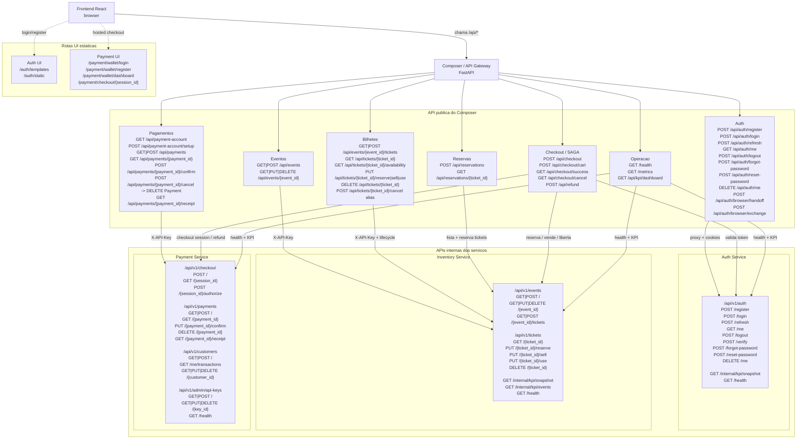

# Diagrama - APIs

```mermaid
flowchart TB
    FE["Frontend React<br/>browser"] -->|"chama /api/*"| C["Composer / API Gateway<br/>FastAPI"]

    subgraph COMPOSER_API["API publica do Composer"]
        AUTH_API["Auth<br/>POST /api/auth/register<br/>POST /api/auth/login<br/>POST /api/auth/refresh<br/>GET /api/auth/me<br/>POST /api/auth/logout<br/>POST /api/auth/forgot-password<br/>POST /api/auth/reset-password<br/>DELETE /api/auth/me<br/>POST /api/auth/browser/handoff<br/>POST /api/auth/browser/exchange"]
        EVENT_API["Eventos<br/>GET|POST /api/events<br/>GET|PUT|DELETE /api/events/{event_id}"]
        TICKET_API["Bilhetes<br/>GET|POST /api/events/{event_id}/tickets<br/>GET /api/tickets/{ticket_id}<br/>GET /api/tickets/{ticket_id}/availability<br/>PUT /api/tickets/{ticket_id}/reserve|sell|use<br/>DELETE /api/tickets/{ticket_id}<br/>POST /api/tickets/{ticket_id}/cancel alias"]
        RES_API["Reservas<br/>POST /api/reservations<br/>GET /api/reservations/{ticket_id}"]
        PAYMENT_API["Pagamentos<br/>GET /api/payment-account<br/>POST /api/payment-account/setup<br/>GET|POST /api/payments<br/>GET /api/payments/{payment_id}<br/>POST /api/payments/{payment_id}/confirm<br/>POST /api/payments/{payment_id}/cancel -> DELETE Payment<br/>GET /api/payments/{payment_id}/receipt"]
        CHECKOUT_API["Checkout / SAGA<br/>POST /api/checkout<br/>POST /api/checkout/cart<br/>GET /api/checkout/success<br/>GET /api/checkout/cancel<br/>POST /api/refund"]
        OPS_API["Operacao<br/>GET /health<br/>GET /metrics<br/>GET /api/kpi/dashboard"]
    end

    C --> AUTH_API
    C --> EVENT_API
    C --> TICKET_API
    C --> RES_API
    C --> PAYMENT_API
    C --> CHECKOUT_API
    C --> OPS_API

    subgraph BUSINESS_APIS["APIs internas dos servicos"]
        subgraph AUTH_SERVICE["Auth Service"]
            AUTH_INTERNAL["/api/v1/auth<br/>POST /register<br/>POST /login<br/>POST /refresh<br/>GET /me<br/>POST /logout<br/>POST /verify<br/>POST /forgot-password<br/>POST /reset-password<br/>DELETE /me<br/><br/>GET /internal/kpi/snapshot<br/>GET /health"]
        end

        subgraph INVENTORY_SERVICE["Inventory Service"]
            INV_INTERNAL["/api/v1/events<br/>GET|POST /<br/>GET|PUT|DELETE /{event_id}<br/>GET|POST /{event_id}/tickets<br/><br/>/api/v1/tickets<br/>GET /{ticket_id}<br/>PUT /{ticket_id}/reserve<br/>PUT /{ticket_id}/sell<br/>PUT /{ticket_id}/use<br/>DELETE /{ticket_id}<br/><br/>GET /internal/kpi/snapshot<br/>GET /internal/kpi/events<br/>GET /health"]
        end

        subgraph PAYMENT_SERVICE["Payment Service"]
            PAY_INTERNAL["/api/v1/checkout<br/>POST /<br/>GET /{session_id}<br/>POST /{session_id}/authorize<br/><br/>/api/v1/payments<br/>GET|POST /<br/>GET /{payment_id}<br/>PUT /{payment_id}/confirm<br/>DELETE /{payment_id}<br/>GET /{payment_id}/receipt<br/><br/>/api/v1/customers<br/>GET|POST /<br/>GET /me/transactions<br/>GET|PUT|DELETE /{customer_id}<br/><br/>/api/v1/admin/api-keys<br/>GET|POST /<br/>GET|PUT|DELETE /{key_id}<br/>GET /health"]
        end
    end

    AUTH_API -->|"proxy + cookies"| AUTH_INTERNAL
    EVENT_API -->|"X-API-Key"| INV_INTERNAL
    TICKET_API -->|"X-API-Key + lifecycle"| INV_INTERNAL
    RES_API -->|"lista + reserva tickets"| INV_INTERNAL

    PAYMENT_API -->|"X-API-Key"| PAY_INTERNAL
    CHECKOUT_API -->|"valida token"| AUTH_INTERNAL
    CHECKOUT_API -->|"reserva / vende / liberta"| INV_INTERNAL
    CHECKOUT_API -->|"checkout session / refund"| PAY_INTERNAL
    OPS_API -->|"health + KPI"| AUTH_INTERNAL
    OPS_API -->|"health + KPI"| INV_INTERNAL
    OPS_API -->|"health + KPI"| PAY_INTERNAL

    subgraph STATIC_UI["Rotas UI estaticas"]
        AUTH_UI["Auth UI<br/>/auth/templates<br/>/auth/static"]
        PAY_UI["Payment UI<br/>/payment/wallet/login<br/>/payment/wallet/register<br/>/payment/wallet/dashboard<br/>/payment/checkout/{session_id}"]
    end

    FE -. login/register .-> AUTH_UI
    FE -. hosted checkout .-> PAY_UI
```
