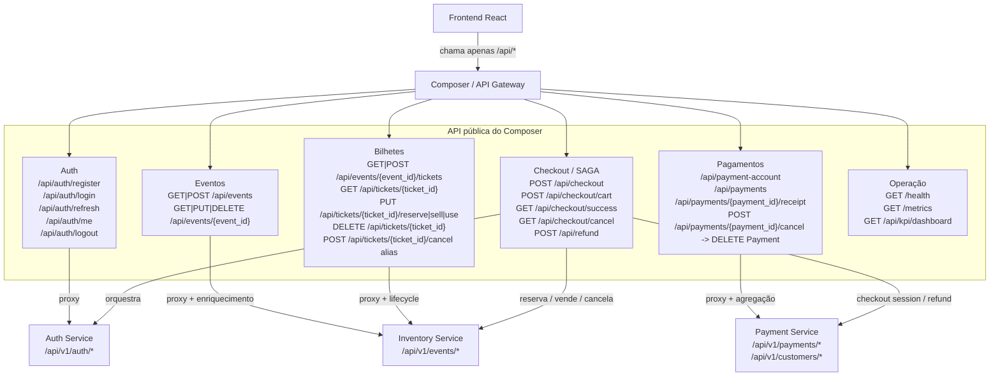

# Diagrama - APIs

```mermaid
flowchart TB
    FE[Frontend React] -->|chama apenas /api/*| C[Composer / API Gateway]

    subgraph PUBLIC_API[API pública do Composer]
        AUTH_API["Auth<br/>/api/auth/register<br/>/api/auth/login<br/>/api/auth/refresh<br/>/api/auth/me<br/>/api/auth/logout"]
        EVENT_API["Eventos<br/>GET|POST /api/events<br/>GET|PUT|DELETE /api/events/{event_id}"]
        TICKET_API["Bilhetes<br/>GET|POST /api/events/{event_id}/tickets<br/>GET /api/tickets/{ticket_id}<br/>PUT /api/tickets/{ticket_id}/reserve|sell|use<br/>DELETE /api/tickets/{ticket_id}<br/>POST /api/tickets/{ticket_id}/cancel alias"]
        PAYMENT_API["Pagamentos<br/>/api/payment-account<br/>/api/payments<br/>/api/payments/{payment_id}/receipt<br/>POST /api/payments/{payment_id}/cancel -> DELETE Payment"]
        CHECKOUT_API["Checkout / SAGA<br/>POST /api/checkout<br/>POST /api/checkout/cart<br/>GET /api/checkout/success<br/>GET /api/checkout/cancel<br/>POST /api/refund"]
        OPS_API["Operação<br/>GET /health<br/>GET /metrics<br/>GET /api/kpi/dashboard"]
    end

    C --> AUTH_API
    C --> EVENT_API
    C --> TICKET_API
    C --> PAYMENT_API
    C --> CHECKOUT_API
    C --> OPS_API

    AUTH_API -->|proxy| AUTH_SERVICE["Auth Service<br/>/api/v1/auth/*"]
    EVENT_API -->|proxy + enriquecimento| INV_SERVICE["Inventory Service<br/>/api/v1/events/*"]
    TICKET_API -->|proxy + lifecycle| INV_SERVICE
    PAYMENT_API -->|proxy + agregação| PAY_SERVICE["Payment Service<br/>/api/v1/payments/*<br/>/api/v1/customers/*"]
    CHECKOUT_API -->|orquestra| AUTH_SERVICE
    CHECKOUT_API -->|reserva / vende / cancela| INV_SERVICE
    CHECKOUT_API -->|checkout session / refund| PAY_SERVICE
```
