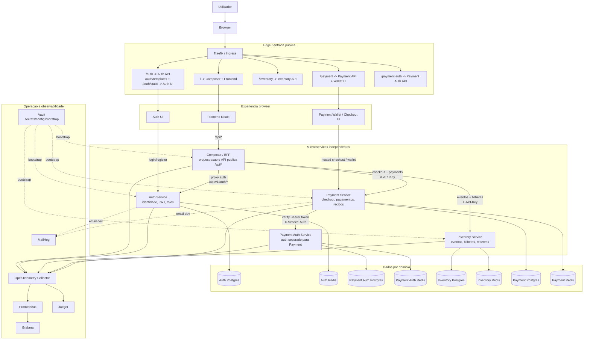

# Diagrama - Arquitectura

```mermaid
flowchart TB
    USER["Utilizador"] --> BROWSER["Browser"]

    subgraph EDGE["Edge / entrada publica"]
        TRAEFIK["Traefik / Ingress"]
        ROOT["/ -> Composer + Frontend"]
        AUTH_PUBLIC["/auth -> Auth API<br/>/auth/templates + /auth/static -> Auth UI"]
        INV_PUBLIC["/inventory -> Inventory API"]
        PAY_PUBLIC["/payment -> Payment API + Wallet UI"]
        PAY_AUTH_PUBLIC["/payment-auth -> Payment Auth API"]
    end

    BROWSER --> TRAEFIK
    TRAEFIK --> ROOT
    TRAEFIK --> AUTH_PUBLIC
    TRAEFIK --> INV_PUBLIC
    TRAEFIK --> PAY_PUBLIC
    TRAEFIK --> PAY_AUTH_PUBLIC

    subgraph FRONTEND["Experiencia browser"]
        FE["Frontend React"]
        AUTH_UI["Auth UI"]
        PAY_UI["Payment Wallet / Checkout UI"]
    end

    ROOT --> FE
    AUTH_PUBLIC --> AUTH_UI
    PAY_PUBLIC --> PAY_UI

    subgraph SERVICES["Microsservicos independentes"]
        COMPOSER["Composer / BFF<br/>orquestracao e API publica /api/*"]
        AUTH["Auth Service<br/>identidade, JWT, roles"]
        INVENTORY["Inventory Service<br/>eventos, bilhetes, reservas"]
        PAYMENT["Payment Service<br/>checkout, pagamentos, recibos"]
        PAYMENT_AUTH["Payment Auth Service<br/>auth separado para Payment"]
    end

    FE -->|"/api/*"| COMPOSER
    AUTH_UI -->|"login/register"| AUTH
    PAY_UI -->|"hosted checkout / wallet"| PAYMENT

    COMPOSER -->|"proxy auth<br/>/api/v1/auth/*"| AUTH
    COMPOSER -->|"eventos + bilhetes<br/>X-API-Key"| INVENTORY
    COMPOSER -->|"checkout + payments<br/>X-API-Key"| PAYMENT
    PAYMENT -->|"verify Bearer token<br/>X-Service-Auth"| PAYMENT_AUTH

    subgraph DATA["Dados por dominio"]
        AUTH_DB[("Auth Postgres")]
        AUTH_REDIS[("Auth Redis")]
        PAUTH_DB[("Payment Auth Postgres")]
        PAUTH_REDIS[("Payment Auth Redis")]
        INV_DB[("Inventory Postgres")]
        INV_REDIS[("Inventory Redis")]
        PAY_DB[("Payment Postgres")]
        PAY_REDIS[("Payment Redis")]
    end

    AUTH --> AUTH_DB
    AUTH --> AUTH_REDIS
    PAYMENT_AUTH --> PAUTH_DB
    PAYMENT_AUTH --> PAUTH_REDIS
    INVENTORY --> INV_DB
    INVENTORY --> INV_REDIS
    PAYMENT --> PAY_DB
    PAYMENT --> PAY_REDIS

    subgraph OPS["Operacao e observabilidade"]
        VAULT["Vault<br/>secrets/config bootstrap"]
        OTEL["OpenTelemetry Collector"]
        PROM["Prometheus"]
        GRAF["Grafana"]
        JAEGER["Jaeger"]
        MAIL["MailHog"]
    end

    VAULT -. bootstrap .-> COMPOSER
    VAULT -. bootstrap .-> AUTH
    VAULT -. bootstrap .-> INVENTORY
    VAULT -. bootstrap .-> PAYMENT
    COMPOSER --> OTEL
    AUTH --> OTEL
    PAYMENT_AUTH --> OTEL
    INVENTORY --> OTEL
    PAYMENT --> OTEL
    OTEL --> PROM
    OTEL --> JAEGER
    PROM --> GRAF
    AUTH -. email dev .-> MAIL
    PAYMENT -. email dev .-> MAIL
```
