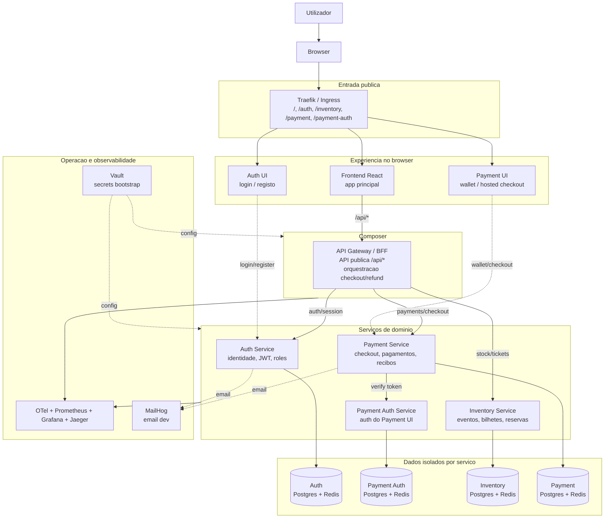

# Diagrama - Arquitectura

```mermaid
flowchart TB
    USER["Utilizador"] --> BROWSER["Browser"]

    subgraph EDGE["Entrada publica"]
        INGRESS["Traefik / Ingress<br/>/, /auth, /inventory, /payment, /payment-auth"]
    end

    BROWSER --> INGRESS

    subgraph UI["Experiencia no browser"]
        FE["Frontend React<br/>app principal"]
        AUTH_UI["Auth UI<br/>login / registo"]
        PAY_UI["Payment UI<br/>wallet / hosted checkout"]
    end

    INGRESS --> FE
    INGRESS --> AUTH_UI
    INGRESS --> PAY_UI

    subgraph BFF["Composer"]
        COMPOSER["API Gateway / BFF<br/>API publica /api/*<br/>orquestracao checkout/refund"]
    end

    subgraph DOMAIN["Servicos de dominio"]
        AUTH["Auth Service<br/>identidade, JWT, roles"]
        INVENTORY["Inventory Service<br/>eventos, bilhetes, reservas"]
        PAYMENT["Payment Service<br/>checkout, pagamentos, recibos"]
        PAYMENT_AUTH["Payment Auth Service<br/>auth do Payment UI"]
    end

    FE -->|"/api/*"| COMPOSER
    AUTH_UI -. login/register .-> AUTH
    PAY_UI -. wallet/checkout .-> PAYMENT

    COMPOSER -->|"auth/session"| AUTH
    COMPOSER -->|"stock/tickets"| INVENTORY
    COMPOSER -->|"payments/checkout"| PAYMENT
    PAYMENT -->|"verify token"| PAYMENT_AUTH

    subgraph DATA["Dados isolados por servico"]
        AUTH_DATA[("Auth<br/>Postgres + Redis")]
        PAUTH_DATA[("Payment Auth<br/>Postgres + Redis")]
        INV_DATA[("Inventory<br/>Postgres + Redis")]
        PAY_DATA[("Payment<br/>Postgres + Redis")]
    end

    AUTH --> AUTH_DATA
    PAYMENT_AUTH --> PAUTH_DATA
    INVENTORY --> INV_DATA
    PAYMENT --> PAY_DATA

    subgraph OPS["Operacao e observabilidade"]
        VAULT["Vault<br/>secrets bootstrap"]
        OBS["OTel + Prometheus + Grafana + Jaeger"]
        MAIL["MailHog<br/>email dev"]
    end

    VAULT -. config .-> BFF
    VAULT -. config .-> DOMAIN
    BFF --> OBS
    DOMAIN --> OBS
    AUTH -. email .-> MAIL
    PAYMENT -. email .-> MAIL
```
