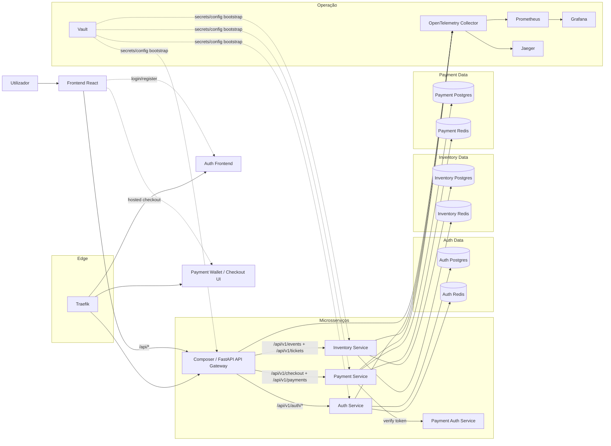

# Diagrama - Arquitectura

```mermaid
flowchart LR
    USER[Utilizador] --> FE[Frontend React]
    FE -->|/api/*| COMPOSER[Composer / FastAPI API Gateway]
    FE -. login/register .-> AUTH_UI[Auth Frontend]
    FE -. hosted checkout .-> PAY_UI[Payment Wallet / Checkout UI]

    subgraph EDGE[Edge]
        TRAEFIK[Traefik]
    end

    TRAEFIK --> COMPOSER
    TRAEFIK --> AUTH_UI
    TRAEFIK --> PAY_UI

    subgraph SERVICES[Microsserviços]
        COMPOSER
        AUTH[Auth Service]
        INVENTORY[Inventory Service]
        PAYMENT[Payment Service]
        PAYMENT_AUTH[Payment Auth Service]
    end

    COMPOSER -->|/api/v1/auth/*| AUTH
    COMPOSER -->|/api/v1/events + /api/v1/tickets| INVENTORY
    COMPOSER -->|/api/v1/checkout + /api/v1/payments| PAYMENT
    PAYMENT -->|verify token| PAYMENT_AUTH

    subgraph AUTH_DATA[Auth Data]
        AUTH_DB[(Auth Postgres)]
        AUTH_REDIS[(Auth Redis)]
    end

    subgraph INV_DATA[Inventory Data]
        INV_DB[(Inventory Postgres)]
        INV_REDIS[(Inventory Redis)]
    end

    subgraph PAY_DATA[Payment Data]
        PAY_DB[(Payment Postgres)]
        PAY_REDIS[(Payment Redis)]
    end

    AUTH --> AUTH_DB
    AUTH --> AUTH_REDIS
    INVENTORY --> INV_DB
    INVENTORY --> INV_REDIS
    PAYMENT --> PAY_DB
    PAYMENT --> PAY_REDIS

    subgraph OPS[Operação]
        VAULT[Vault]
        OTEL[OpenTelemetry Collector]
        PROM[Prometheus]
        GRAF[Grafana]
        JAEGER[Jaeger]
    end

    VAULT -. secrets/config bootstrap .-> COMPOSER
    VAULT -. secrets/config bootstrap .-> AUTH
    VAULT -. secrets/config bootstrap .-> INVENTORY
    VAULT -. secrets/config bootstrap .-> PAYMENT
    COMPOSER --> OTEL
    AUTH --> OTEL
    INVENTORY --> OTEL
    PAYMENT --> OTEL
    OTEL --> PROM
    OTEL --> JAEGER
    PROM --> GRAF
```
