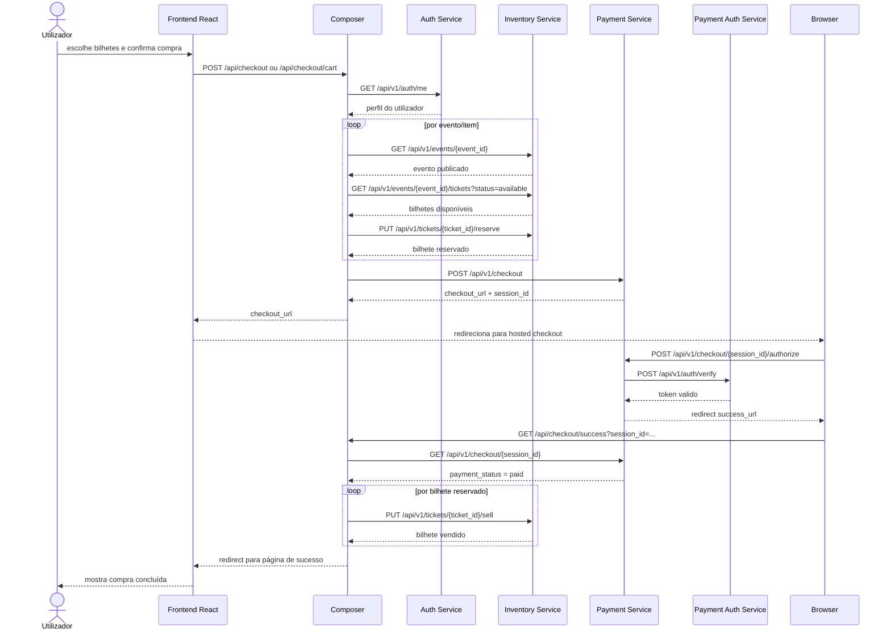
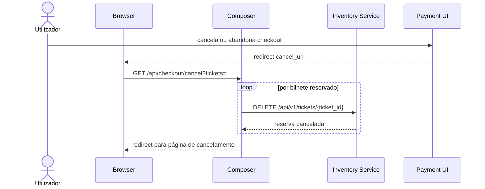

# Diagrama - Checkout

```mermaid
sequenceDiagram
    actor U as Utilizador
    participant FE as Frontend React
    participant C as Composer
    participant A as Auth Service
    participant I as Inventory Service
    participant P as Payment Service
    participant PA as Payment Auth Service
    participant B as Browser

    U->>FE: escolhe bilhetes e confirma compra
    FE->>C: POST /api/checkout ou /api/checkout/cart
    C->>A: GET /api/v1/auth/me
    A-->>C: perfil do utilizador

    loop por evento/item
        C->>I: GET /api/v1/events/{event_id}
        I-->>C: evento publicado
        C->>I: GET /api/v1/events/{event_id}/tickets?status=available
        I-->>C: bilhetes disponíveis
        C->>I: PUT /api/v1/tickets/{ticket_id}/reserve
        I-->>C: bilhete reservado
    end

    C->>P: POST /api/v1/checkout
    P-->>C: checkout_url + session_id
    C-->>FE: checkout_url
    FE-->>B: redireciona para hosted checkout

    B->>P: POST /api/v1/checkout/{session_id}/authorize
    P->>PA: POST /api/v1/auth/verify
    PA-->>P: token valido
    P-->>B: redirect success_url
    B->>C: GET /api/checkout/success?session_id=...
    C->>P: GET /api/v1/checkout/{session_id}
    P-->>C: payment_status = paid

    loop por bilhete reservado
        C->>I: PUT /api/v1/tickets/{ticket_id}/sell
        I-->>C: bilhete vendido
    end

    C-->>FE: redirect para página de sucesso
    FE-->>U: mostra compra concluída
```

## Caminho de cancelamento

```mermaid
sequenceDiagram
    actor U as Utilizador
    participant B as Browser
    participant C as Composer
    participant I as Inventory Service
    participant P as Payment UI

    U->>P: cancela ou abandona checkout
    P-->>B: redirect cancel_url
    B->>C: GET /api/checkout/cancel?tickets=...
    loop por bilhete reservado
        C->>I: DELETE /api/v1/tickets/{ticket_id}
        I-->>C: reserva cancelada
    end
    C-->>B: redirect para página de cancelamento
```
